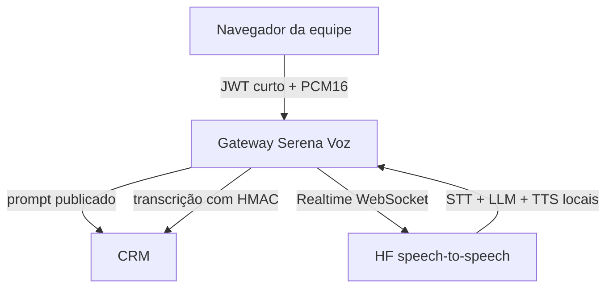

# Serena Voz

Laboratório interno de conversa falada da Serena, baseado no projeto livre
[`huggingface/speech-to-speech`](https://github.com/huggingface/speech-to-speech)
(Apache 2.0). A cadeia é VAD → transcrição → modelo de linguagem → síntese de
voz e usa o protocolo WebSocket compatível com OpenAI Realtime.

## Escopo seguro desta entrega

- só pessoas autenticadas da equipe abrem uma sessão;
- o microfone só abre depois de consentimento explícito;
- a sessão é individual, auditada, dura no máximo 15 minutos por padrão;
- o navegador envia PCM16 mono a 16 kHz e recebe PCM16 mono a 24 kHz;
- áudio bruto não é gravado; transcrições são persistidas para auditoria;
- o gateway ignora `session.update` do navegador e injeta o prompt publicado no CRM;
- nesta fase a voz não agenda, não prescreve, não envia mensagem e não atende paciente;
- não existe fallback silencioso para API paga.

Isso é deliberadamente um laboratório. Liberar voz para paciente exige uma
segunda etapa: homologação clínica, política de retenção, aviso legal, teste de
carga, monitoramento de latência e integração das ferramentas pelo OpenClaw.

## Arquitetura



O CRM continua como fonte de verdade. O motor não recebe credencial do usuário,
não consulta o banco e não decide o prompt. Os dois segredos de voz são
independentes do JWT normal do CRM.

## Subir o gateway

```bash
cd servicos/serena-voz
cp .env.exemplo .env
# preencha CRM_BASE_URL, os dois segredos e ALLOWED_ORIGINS
docker build -t crmclinica-serena-voz .
docker run --rm --env-file .env -p 8000:8000 crmclinica-serena-voz
```

Em produção, publique o gateway atrás de TLS e configure no CRM:

```dotenv
SERENA_VOZ_ATIVA=sim
SERENA_VOZ_GATEWAY_URL=wss://voz.exemplo.com/v1/realtime
SERENA_VOZ_JWT_SECRET=
SERENA_VOZ_WEBHOOK_SECRET=
```

Os valores dos dois segredos precisam ser iguais no CRM e no gateway. Gere cada
um separadamente com `node -e "console.log(require('crypto').randomBytes(48).toString('base64url'))"`.
Não coloque o token da sessão em logs do proxy; URLs de WebSocket contêm um JWT
de uso único e curta duração.

## Subir o motor livre

O projeto oficial exige Python 3.10 ou superior. A instalação padrão é pesada;
no Galaxy Book com 16 GB, comece por WSL2/Ubuntu, CPU e modelos menores:

```bash
python -m venv .venv
source .venv/bin/activate
pip install "speech-to-speech[faster-whisper,pocket]"

# O LLM também é local e expõe API compatível na porta 8080.
llama-server -hf ggml-org/gemma-4-E4B-it-GGUF -np 1 -c 8192

speech-to-speech \
  --stt faster-whisper \
  --faster_whisper_stt_model_name small \
  --faster_whisper_stt_device cpu \
  --faster_whisper_stt_compute_type int8 \
  --faster_whisper_stt_gen_language pt \
  --tts pocket \
  --pocket_tts_device cpu \
  --llm_backend responses-api \
  --responses_api_base_url http://127.0.0.1:8080/v1 \
  --responses_api_api_key "" \
  --mode realtime
```

Confirme as opções com `speech-to-speech -h`: o projeto está em estágio Alpha e
nomes de flags podem mudar. A configuração acima prioriza caber em CPU; a voz e
a latência precisam ser homologadas em português. Para qualidade, o perfil
padrão do projeto (Parakeet + Qwen3-TTS) se beneficia muito de GPU. Software
livre não significa computação sem custo: o servidor da Hostinger só sustentará
tempo real se CPU e memória forem suficientes.

O gateway aponta para o motor com:

```dotenv
SPEECH_TO_SPEECH_WS_URL=ws://host-do-motor:8765/v1/realtime
```

## Banco, teste e ativação

```bash
psql "$CRMCLINICA_DATABASE_URL" -f db/012_serena_voz.sql
npm test
npm run test:voz
npm run verificar-banco
```

Sequência de liberação:

1. deixe `SERENA_VOZ_ATIVA=nao` e valide `/health` nos dois serviços;
2. publique e revise o prompt e as barreiras clínicas da Serena;
3. teste com fone de ouvido e dados fictícios;
4. meça latência, corte de fala e qualidade do português;
5. ligue a flag apenas para avaliação interna;
6. desligue imediatamente se transcrição ou resposta fugir do esperado.

## Falhas previstas

| Falha | Comportamento |
| --- | --- |
| flag desligada ou segredo ausente | CRM recusa criar sessão com 503 |
| Serena desligada ou sem prompt | CRM recusa com 409 |
| origem, JWT ou HMAC inválido | gateway/CRM recusam antes de processar |
| mensagem ou áudio grande | gateway encerra a sessão |
| motor indisponível | sessão encerra sem executar ação no CRM |
| evento repetido | índice de idempotência preserva um único turno |
| limite de tempo | WebSocket fecha; o microfone é liberado |

## API interna

| Rota | Autorização | Uso |
| --- | --- | --- |
| `GET /api/serena/voz/status` | sessão da equipe | prontidão sem expor segredo |
| `POST /api/serena/voz/sessoes` | sessão + consentimento | cria JWT curto e URL WebSocket |
| `POST /api/serena/voz/sessoes/:id/encerrar` | dono/admin | encerra a sessão |
| `GET /api/serena/voz/contexto` | JWT de voz | prompt efetivo para o gateway |
| `POST /api/serena/voz/eventos` | HMAC + timestamp | grava transcrição idempotente |

## Testes antes de falar com paciente

- conteúdo adversarial tentando trocar o prompt;
- vazamento de dado entre duas sessões simultâneas;
- eco, interrupção e fala sobreposta;
- sotaques, ruído e termos médicos em português;
- queda do motor, CRM e rede no meio da fala;
- expiração, replay, origem falsa e carga acima do limite;
- confirmação humana antes de qualquer futura ação externa.
